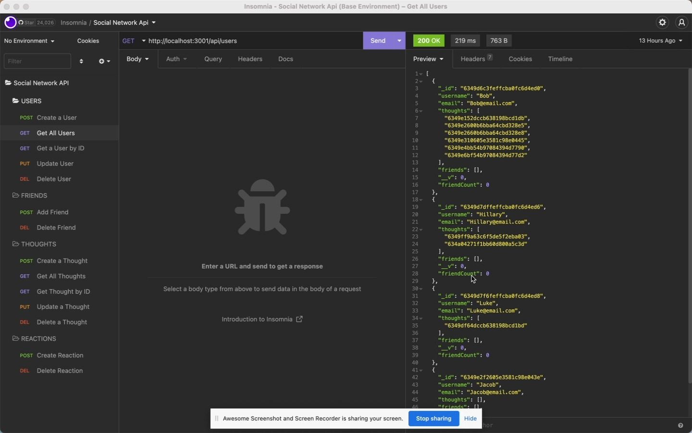

# social-network-API
18-NoSQL

## Table of Contents
1. [Description](#description)
2. [Usage](#usage)
3. [Visuals](#visuals)

## Description
This application is a Social network where users can share their thoughts, react to friends, and create a friend's list.  Express.js was used for routing, MongoDB was the database, the Mongoose ODM, and Insomnia Core for demonstration.

## Usage
To use this application, first clone the project and navigate to VS Code. In the command-line, install the following packages:
- npm i mongoose
- npm i express

To start the application, type 'nodemon server.js' in the command-line.

## Visuals

[Click this link to access the walkthrough video](https://watch.screencastify.com/v/4uImSlHhb3lrwAQBOXqd) 